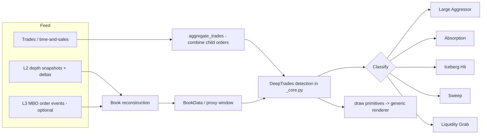

# Design: DeepTrades (depth-of-market / MBO detector)

Status: IMPLEMENTED (L2 + L3). Phases 1-4 are shipped: real-time WebSocket
streaming (CCXT Pro), the `BookData` type + `LiveBookRing` + `OrderbookProxy`,
self-recording and deterministic replay with backtest==live parity, the
`DeepTrades` detector for Large Aggressor / Absorption / Sweep on L2 depth, and
the L3 / MBO layer (`MboData`, `subscribe_mbo`, `MboRing`/`MboProxy`) with
`detect_iceberg` / `detect_liquidity_grab` and a `DeepTrades(mbo=...)` mode that
upgrades coincident events to Iceberg / Liquidity Grab. Also added: a private
authenticated user-data stream (`ORDER`/`FILL` events replacing `sync()`
polling) and `ReplayEngine` playback of a recorded L2 book in the pause/play UI.
Note: public crypto venues rarely expose true L3/MBO, so that path is primarily
fed via replay of recorded MBO logs. See `src/tradetropy/streaming/`,
`src/tradetropy/ta/order_flow/deep_trades.py` and the `test_streaming_*` /
`test_deep_trades_*` / `test_mbo*` suites.

## 1. Motivation and scope

The shipped `LargeTrades` indicator (see `src/tradetropy/ta/order_flow/`) is a
statistical detector of large *aggressive executions*. It reads the
time-and-sales (tick) feed only and ranks trades (or aggregated bursts) by
`volume`, `notional` or net `delta`. It knows nothing about resting liquidity:
it can tell you a 500-lot buy printed, but not whether that 500-lot ate through
a 450-lot wall, was absorbed by a refreshing iceberg, or swept three price
levels.

`DeepTrades` is the reserved name for the detector that answers those questions.
It is fundamentally a different class of indicator because it requires a
different class of data: the order book (L2 depth) and ideally per-order events
(L3 / MBO - market-by-order). With that data it can classify each large
execution as one of:

- Large Aggressor - a big trade that does not exhaust the opposing liquidity.
- Absorption - large aggressive volume hitting a resting wall that does NOT
  move (the wall absorbs the flow; price stalls).
- Iceberg Hit - a price level that keeps refilling after being eaten, revealing
  a hidden reload order.
- Sweep - a single aggressive order that consumes multiple book levels in one
  shot (liquidity taken across the stack).
- Liquidity Grab - a fast sweep through a level followed by a reversal (stop
  run), i.e. liquidity taken then price rejects.

## 2. Why it cannot be built on the current data

Today the framework only carries L1 (top-of-book) tick data.

- `TickData` is an `[N x 7]` array: `ts, bid, ask, volume, flags, volume_real,
  price` (see `src/tradetropy/core/data_types.py`). Only the best bid and best ask
  are present - no depth beyond level 1, no resting sizes per level, no order
  ids.
- The only subscriptions are `subscribe_ticks(...)` and `subscribe_ohlc(...)`
  (see `src/tradetropy/models/strategy.py`). There is no `subscribe_book` /
  `subscribe_depth`.
- Connectors (`src/tradetropy/connectors/`) stream trades and L1 quotes; they do
  not ingest depth snapshots or diffs.

Absorption, icebergs, sweeps and liquidity grabs are all statements about
resting liquidity and how it changes around an execution. None of that is
observable from L1 trades. Building `DeepTrades` therefore requires a new data
pipeline first; the indicator itself is the smallest part of the work.

## 3. Required data infrastructure

The work breaks into a data layer (new) and an indicator layer (mostly mirrors
the existing `Indicator` contract).

### 3.1 New data type: `BookData` (L2) and optional `MboData` (L3)

A depth snapshot/delta stream stored in a compact, vectorized form consistent
with the existing `TickData` / `KlineData` style (NumPy-first, Bokeh-free).

Proposed L2 layout - a ragged structure flattened into fixed-width arrays for a
bounded number of levels `K`:

```
BookData(symbol, tick_size)
  ts        : int64  [N]            event timestamp (ms)
  bid_px    : float64 [N x K]       bid prices, level 0 = best
  bid_sz    : float64 [N x K]       bid resting sizes
  ask_px    : float64 [N x K]       ask prices, level 0 = best
  ask_sz    : float64 [N x K]       ask resting sizes
  kind      : int8   [N]            0 = snapshot, 1 = delta/update
```

`K` (number of book levels retained) is a construction-time parameter, e.g.
`book_levels=10`. Snapshots reset the book; deltas mutate it. The store keeps a
rolling window like the tick ring buffer.

Optional L3 / MBO layout for true iceberg/reload detection (a separate, heavier
feed):

```
MboData(symbol, tick_size)
  ts        : int64  [M]
  order_id  : int64  [M]
  side      : int8   [M]            +1 bid / -1 ask
  price     : float64 [M]
  size      : float64 [M]
  action    : int8   [M]            0 add, 1 modify, 2 cancel, 3 trade/fill
```

### 3.2 Subscription API

Add to the strategy data API (mirrors `subscribe_ticks`):

```python
self.book = self.subscribe_book('BTCUSDT', book_levels=10, window_size=5000)
# optional, exchange permitting:
self.mbo  = self.subscribe_mbo('BTCUSDT', window_size=50000)
```

Each returns a proxy exposing windowed column views, analogous to the existing
tick proxy used by `LargeTrades.refs(...)`. The proxy must expose, at the
current time, the reconstructed book (best N levels) plus a way to look back
over the retained window.

### 3.3 Connector support

Each connector (`binance`, `bybit`, `ccxt`, `mt5`) needs:

- A depth subscription (diff stream + periodic snapshot) reconstructed into
  `BookData` updates, with sequence-gap handling and resync on snapshot.
- Optionally an MBO subscription where the venue provides it (few crypto venues
  do; most provide L2 diffs only).
- Backfill/warmup semantics so live mode can prime the book before the strategy
  starts (parallel to `live/_warmup.py`).

### 3.4 Storage and replay

- `io/io.py` and `data/_store.py`: persistence format for depth (snapshots +
  deltas) so backtests can replay an exact book reconstruction.
- `replay/`: deterministic book reconstruction during replay, time-aligned with
  the trade stream so the indicator sees the book state *as of* each trade.
- Backtest engine: a book reconstruction step feeding the indicator's
  `calculate` causally (the book state strictly before/at each trade, never
  after).

## 4. The `DeepTrades` indicator

Once depth data exists, `DeepTrades` follows the standard `Indicator` contract
(`calculate` + declarative `draw()` primitives + `live_refresh` for the
tick/book-mounted live path), exactly like `LargeTrades`. The pure detection
logic lives in `src/tradetropy/ta/order_flow/_core.py` (Bokeh-free, NumPy-only) so
it is shared identically by backtest and live.

### 4.1 Parameters

```python
DeepTrades(
    # liquidity / execution thresholds
    min_trade_volume=100,          # ignore executions below this size
    min_resting_volume=500,        # a level counts as a 'wall' above this size
    absorption_ratio=0.8,          # traded / resting >= this and wall remains -> absorption
    trade_to_liquidity_ratio=0.4,  # traded vs available depth at the level
    iceberg_ratio=3,               # reloads observed at a price -> iceberg
    reload_threshold=3,            # number of refills to confirm an iceberg
    same_price_window_ms=500,      # window to associate reloads at one price
    stack_depth=3,                 # levels consumed to call it a sweep
    # data / engine
    book_levels=10,                # book depth the detector reads
    lookback_ms=2000,              # window for liquidity-grab reversal check
    mbo_enabled=False,             # use L3 order events when available
    combine_child_orders=True,     # merge sliced child fills (see aggregate_trades)
    # styling (object attributes, theme-independent, like LargeTrades)
    buy_color='#2196F3', sell_color='#E91E63',
    label='class',                 # draw the classification tag per event
)
```

### 4.2 Classification logic (sketch)

For each large execution (optionally a combined child-order burst, reusing the
existing `aggregate_trades`):

1. Read the book state at the trade time: resting size at the touched level(s)
   and the levels behind it.
2. Compute consumed vs resting:
   - `traded` = executed size of the (aggregated) order.
   - `resting` = size that was sitting at the touched level just before.
   - `levels_consumed` = how many price levels were fully cleared.
3. Classify:
   - `levels_consumed >= stack_depth` -> Sweep. If followed within
     `lookback_ms` by a reversal back through the swept level -> Liquidity Grab.
   - `traded / resting >= absorption_ratio` AND the level is replenished /
     price does not advance -> Absorption.
   - Repeated refills at the same price (>= `reload_threshold` within
     `same_price_window_ms`), best seen with `mbo_enabled` -> Iceberg Hit.
   - Otherwise, if `traded >= min_trade_volume` -> Large Aggressor.

All checks are causal: only book state at or before the trade, and (for
liquidity grab) a forward reversal check that is itself only confirmable after
`lookback_ms` has elapsed - so the live path emits the base class immediately
and upgrades to Liquidity Grab once the reversal is observed.

### 4.3 Output and drawing

- A bubble per detected event (as `LargeTrades` already does), but colored or
  tagged by classification (Sweep, Absorption, Iceberg Hit, Liquidity Grab,
  Large Aggressor), with the magnitude label.
- Optional auxiliary primitives: a marker at the swept levels, or a shaded band
  over the absorbed wall.
- Bands exposed to `on_data()`: price, volume, side, plus a categorical
  `event_type` and the measured `resting`/`consumed` quantities.

## 5. Data flow



## 6. Phased plan

1. Phase 0 [DONE] - this design; `BookData` layout and classification thresholds.
2. Phase 1 [DONE] - real-time WebSocket transport on CCXT Pro
   (`tradetropy/streaming/`): normalized events, channel-aware EventBus, feed
   thread, engine unified on an event-driven loop.
3. Phase 2 [DONE] - `BookData` + `LiveBookRing` + `OrderbookProxy`
   (`subscribe_orderbook`), book IO, self-recording and deterministic replay
   with backtest==live parity (`book_as_of` causal reconstruction).
4. Phase 3 [DONE] - `DeepTrades` detector in `_core.py` (pure) covering Large
   Aggressor, Absorption and Sweep on L2 only, with `draw()` and `live_refresh`.
5. Phase 4 [DONE] - L3 / MBO ingestion (`MboData`, `subscribe_mbo`,
   `MboRing`/`MboProxy`) and Iceberg / Liquidity-Grab detection
   (`detect_iceberg` / `detect_liquidity_grab`) with `DeepTrades(mbo=...)`
   upgrading coincident events. Public L3 data is scarce, so this path is
   primarily replay-driven (record an MBO log, replay it).
6. Phase 5 [DONE] - docs, examples, and steering updates.

## 7. Open questions

- Which target venue(s) provide usable depth/MBO over their public feeds, and at
  what `book_levels` / message rate? This bounds storage and reconstruction
  cost.
- Snapshot/delta resync strategy and sequence-gap handling per connector.
- How much of the classification should be configurable thresholds vs adaptive
  (percentile-based, like `LargeTrades`' `threshold`).
- Backtest data sourcing: recorded depth is large; define a compact on-disk
  format and a windowed loader.

## 8. Relationship to `LargeTrades`

`LargeTrades` stays as-is: the cheap, public-data-friendly large-execution
detector that most crypto users can feed directly. `DeepTrades` is the
heavier, depth-aware sibling. They share the pure-core module
(`order_flow/_core.py`), the aggressor classification, the burst aggregation
(`aggregate_trades`), and the bubble/labeling style helpers - `DeepTrades` adds
the book-aware classification on top.
